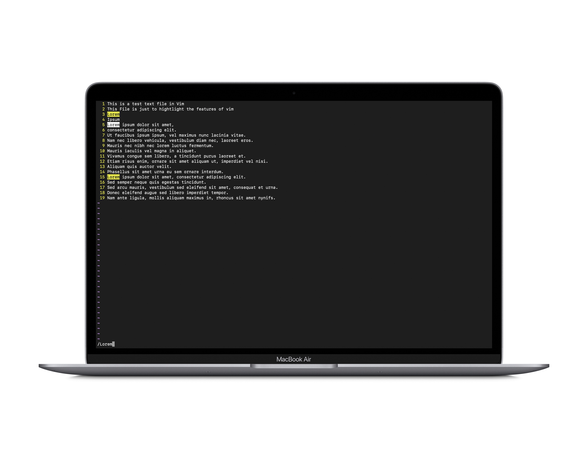
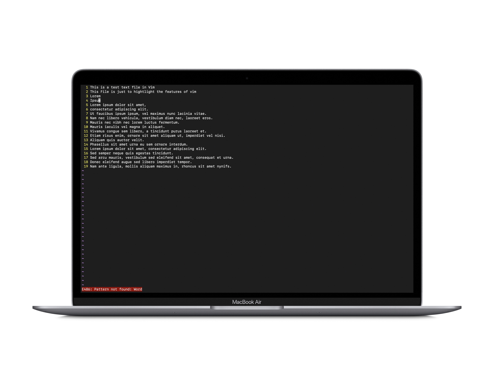
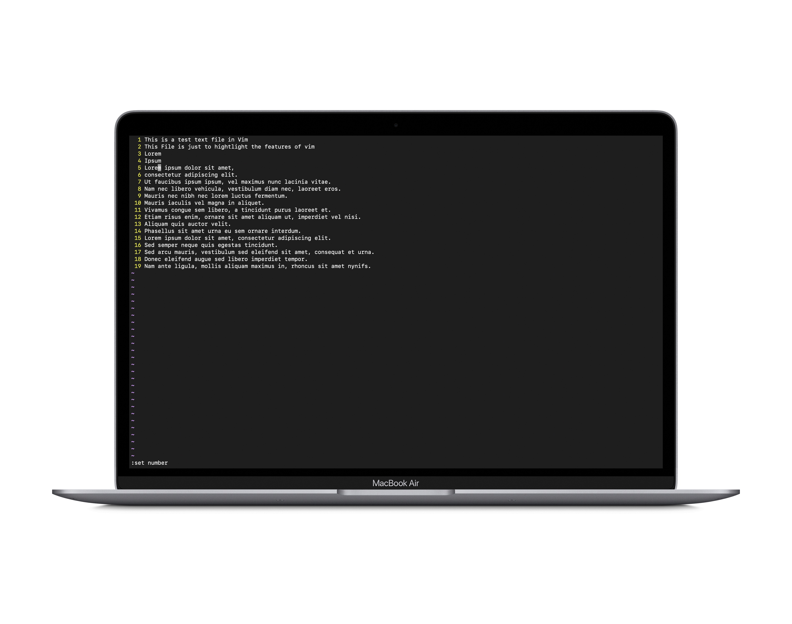
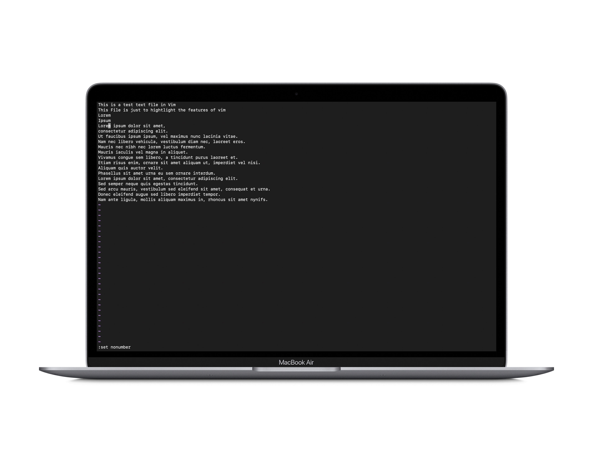
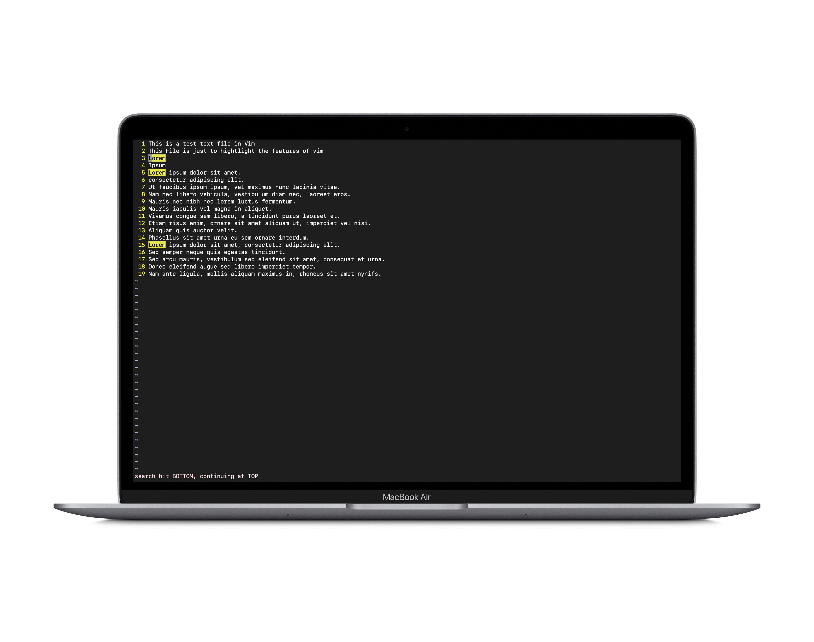
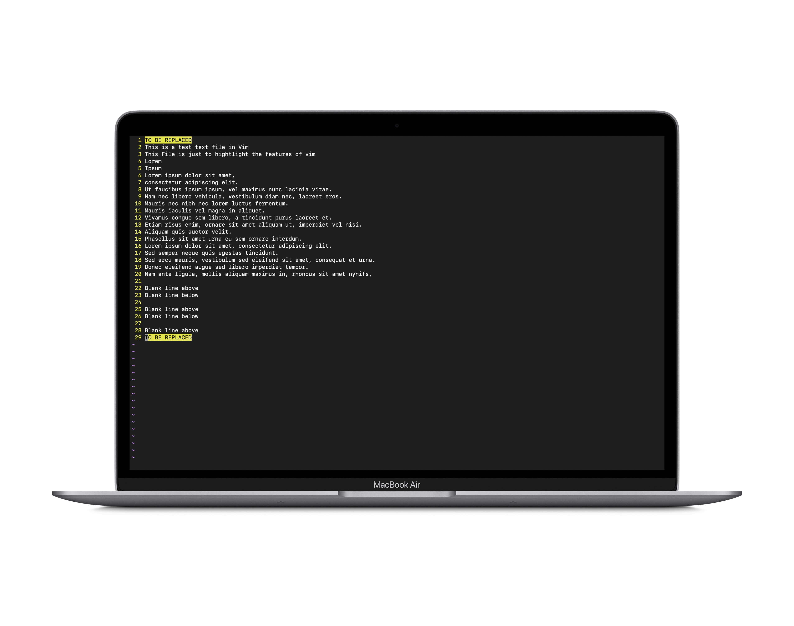
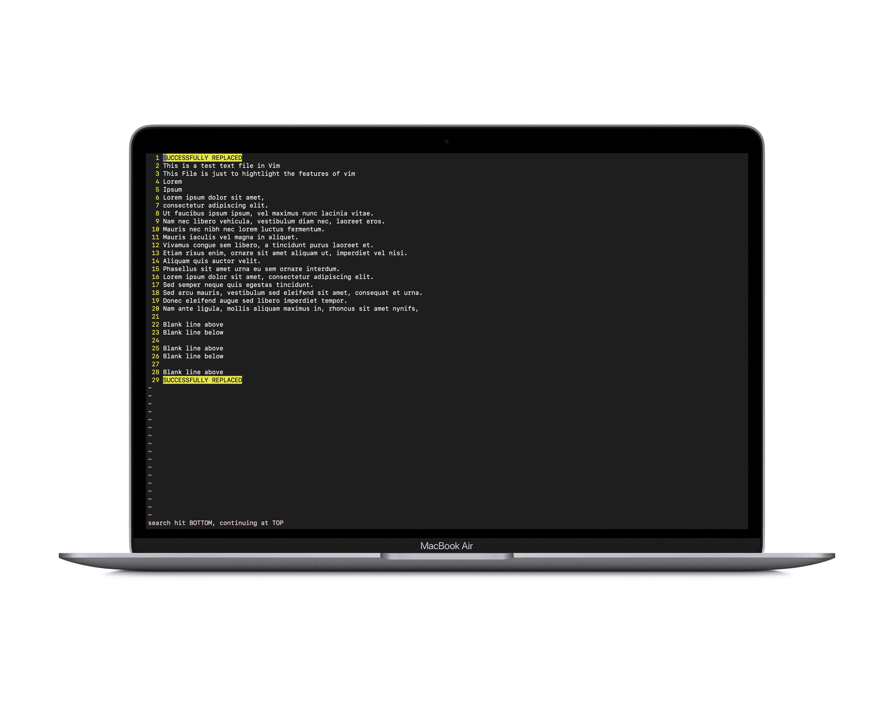
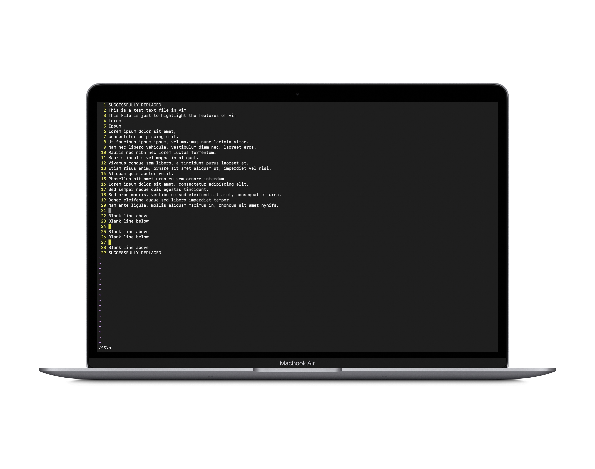
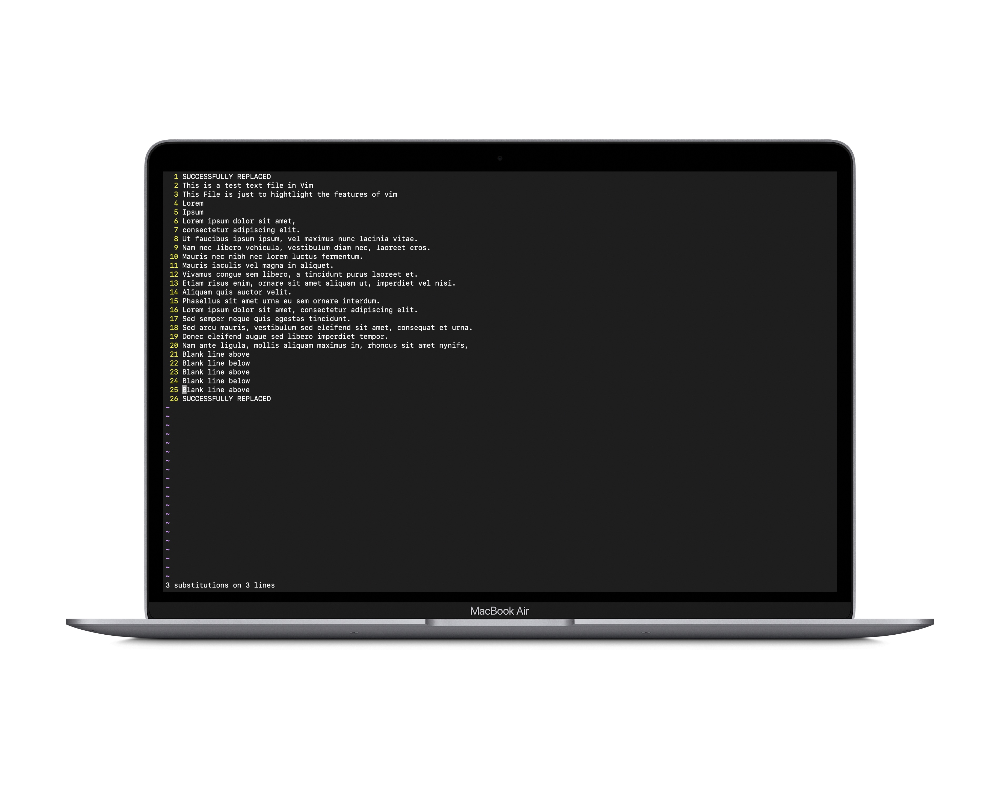

# Exploring Vim
For the final lab report, I have decided to take a deeper dive into a text editor called `Vim`. Yes, you read correctly. Vim! Despite of all the hate it gets and everything that people have to say about it, I feel that Vim is an extremely useful "arrow" in a programmers "quiver". Since Vim wasn't covered in too much detail in class, I took it upon myself to research more about this handy-dandy tool. So let's begin!!
## What is Vim ?
Vim is a highly configurable, free and open-source, screen-based text editor program. It is an improved clone of Bill Joy's `vi`. Vim's author, `Bram Moolenaar`, released the first public version on November 2, 1991. Vim is extremely efficient and can easily run off of the terminal of any machine.
Some of the factors which contribute to the popularity of this text editor include:-
### Advantages of Vim
1. `Speed`: Vim is a highly efficient editor, allowing you to navigate and edit text quickly and with minimal keystrokes.
2. `Minimal resource usage`: Vim is extremely memory effiecient and uses minimal system resources, making it an ideal editor for use on older or low-              powered systems.
3. `Customizability and Scriptability`: Vim is highly customizable, allowing users to configure it to their liking using various plugins, settings, and                      key bindings. Vim also has a powerful scripting language that allows users to automate complex tasks, create custom plugins, and extend Vim's functionality.
4. `Portability`: Vim is available on almost all major operating systems and can be run from the command line, making it a highly portable editor. It also has the capability of being able to convert between different file formats using plugins. 
5. `Powerful editing features`: Vim includes many powerful editing features, such as macros, visual block mode, syntax highlighting and the ability to search and replace text with regular expressions among many others.
6. `Large user community`: Vim has a large and active user community that produces a wide variety of plugins, tutorials, and other resources to help users get the most out of the editor. This means that the editor is constantly updated thanks to its faithful users.
### Modal Editing
This feature deserves an entire section to itself. With its focus on making our workflow more efficient, Vim uses something called as `Modal Editing`, i.e. it has multiple modes in which you can manipulate files. This approach to editing a file means that you never have to take your hands off of the keyboard as everything is command based! The modes available include normal mode, insert mode, visual mode, select mode and command-line mode. In this lab report, I'll only be focussing on normal mode, insert mode and command-line mode.
### Disadvantages of Vim
Every coin has two faces. Similarly, even Vim has some shortcomings. Some of the disadvantages of using Vim are as follows:-
1. `Steep learning curve`: Vim has a steep learning curve and can take some time to master. The editor relies heavily on keyboard shortcuts, and it can take some time to memorize all of the different commands and modes.
2. `Limited graphical interface`: Vim is primarily a command-line editor and has a limited graphical interface. Some users may find the lack of graphical elements and menus to be a disadvantage.
3. `Not suitable for all tasks`: While Vim is great for editing text files, it may not be the best choice for other types of tasks, such as programming in some languages. Despite having features such as syntax highlighting, more specialized editors or IDEs may provide better functionality and features.
4. `Challenging to use on non-Unix systems`: While Vim is available on many operating systems, it was originally designed for Unix-based systems, and some features may not work as expected on other platforms.
## Exploring some Vim commands
Let's explore some features and commands of the Vim text editor!
### 1. Search in Vim
Searching in Vim is fairly straight-forward. Type `/` followed by the word, sequence of characters or words you want to search for and just press `<enter>`. The cursor automatically moves to the first occurance of the word in the file. To find the next occurrence, simply type `n`. And to go back to the previous occurrence, type `N`. To stop searching press `ESC` to go back to normal mode. If no matches are found, the following message will appear on the command line:-
`E486: Pattern not found: "Word"`\
`Search example`:-

(`NOTE`: highlight search has been turned on. More on this in the next section of this report)\
`No match found example`:-

`Fun Fact`: Using `/` for search instructs vim to search from occurences from top to bottom. `?` can also be used to search in vim. `?` instructs vim to search for occurences from bottom to top.
### 2. :set
`:set` command is used to modify various options and settings of the editor. The syntax for the `:set` command is as follows:
```bash
$ :set option
```
Here, 'option' is the name of the setting we intend to change.
There are many options available. Today, we will be looking at `number/nonumber` and `hlsearch`.

`:set number`: Displays line numbers in the left margin of the screen.

`:set nonumber`: Removes the line numbers in the left margin of the screen.


`:set hlsearch`: Highlights all matches when searching for text

To toggle `hlsearch` off, just execute `:set nohlsearch`! (I just keep it on at all times honestly!)
### 3. :s
`:s` is the `substitute` command in vim. As the name suggests, `:s` can be used to substitute anything from words to entire sentences in vim. The syntax for the command is as follows:-
```bash
  $ :%s/SEARCH_PATTERN/REPLACE_PATTERN/gc
```
The `%` sign simply instructs vim to execute the command for the entire file. `SEARCH_PATTERN` represents the string we are looking to replace whereas, `REPLACE_PATTERN` represents the string we are looking to replace `SEARCH_PATTERN` with. The `g` flag at the end of the command makes it apply the substitution to all matches on all the lines, instead of just the first one.
`Before`:

`After`:


The `:s` command can also be used to remove stuff from the file. For example, to remove all the blank lines from the file, the following command can be used:-
```bash
  $ :%s/^$\n//g
```
As explained before, the `%` sign simply instructs vim to execute the command for the entire file. This command uses the 'substitute' (':s') command with a regular expression to match empty lines (`^$\n`) and replace them with nothing (`//`). The `g` flag at the end of the command makes it apply the substitution to all matches on all the lines, instead of just the first one.
`Before`:

`After`:


